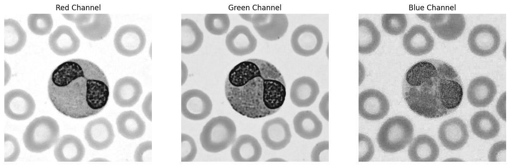
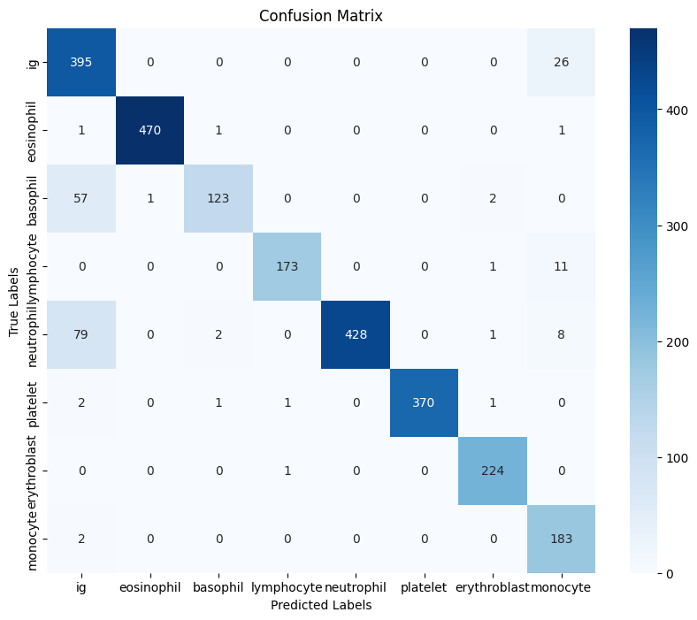

# **Blood Cell Image Classification**



## **Description**
This project focuses on classifying blood cell images into 8 categories using deep learning. The dataset consists of 17,092 high-quality images of normal peripheral blood cells, including neutrophils, eosinophils, basophils, lymphocytes, monocytes, immature granulocytes, erythroblasts, and platelets. The goal is to build a robust model for blood cell classification and deploy it as an interactive web application.


---

## **Features**
1. **Data Visualization**:
   - Visualize the distribution of images across classes.
   - Display sample images from each class.
   - Inspect image properties (size, mode, pixel values).

2. **Data Preprocessing**:
   - Resize images to a fixed size (224x224).
   - Apply data augmentation (random flip, rotation, brightness adjustment).
   - Normalize pixel values to the range [-1, 1].

3. **Model Architecture**:
   - Use a pre-trained ResNet18 model.
   - Replace the final fully connected layer to match the number of classes (8).
   - Train the model using Cross-Entropy Loss and Adam optimizer.

4. **Performance Metrics**:
   - Evaluate the model using accuracy, precision, recall, and F1-score.
   - Plot a confusion matrix to visualize classification performance.

5. **Deployment**:
   - Save the trained model to local storage.
   - Create a web app using Streamlit and Gradio for interactive image classification.

---

## **Requirements**
- Python 3.8+
- Libraries: `torch`, `torchvision`, `matplotlib`, `seaborn`, `scikit-learn`, `streamlit`, `gradio`

---

## **Usage**
1. **Training**:
   - Run the notebook to train the model on the blood cell dataset.
   - Save the trained model to a `.pth` file.

2. **Inference**:
   - Use the saved model to classify new images.
   - Launch the Streamlit or Gradio app for interactive predictions.

---

## **Results**
- **Training Accuracy**: 97.63%
- **Validation Accuracy**: 92.70%
- **Test Accuracy**: 92.50%
- **Confusion Matrix**: Visualizes the model's performance across all classes.



---

## **Future Work**
- Improve model performance using advanced architectures (e.g., EfficientNet, Vision Transformers).
- Deploy the model as a REST API using FastAPI.
- Extend the dataset to include abnormal blood cells for disease detection.


## **GitHub Repository**
[Link to GitHub Repo](https://github.com/yourusername/blood-cell-classification)

---

## **How to Set Up the Environment and Project**

### **1. Prerequisites**
- Python 3.8+
- GPU (optional but recommended for faster training)

### **2. Clone the Repository**
```bash
git clone https://github.com/yourusername/blood-cell-classification.git
cd blood-cell-classification
```


### **4. Download the Dataset**
The dataset is downloaded automatically using the `kagglehub` library. If you want to download it manually, follow these steps:
1. Visit the [Kaggle Dataset Page](https://www.kaggle.com/datasets/unclesamulus/blood-cells-image-dataset).
2. Download the dataset and place it in the `data/` directory.

### **5. Run the Notebook**
Open the Jupyter Notebook or Python script to train the model and evaluate its performance:
```bash
jupyter notebook blood_cell_classification.ipynb
```

### **6. Launch the Web App**
To deploy the model as a web app:

- **Gradio**:
  ```bash
  python gradio_app.py
  ```

---

## **Designs**

### **Figma Mockups**
- **Home Page**: Displays a file upload button and a preview of the uploaded image.
- **Virtual Microscope Canvas**: Displays an interactive microscopy cell with an AI agent.
- **Results Page**: Shows the predicted blood cell type and confidence score.

### **Circuit Diagram**
- Not applicable for this project (software-only).

### **Screenshots of App Interfaces**
1. Find the Figma Mockup here

---


### **2. Cloud Deployment**
- **Streamlit Cloud**: Deploy the app directly to Streamlit Cloud.
- **Gradio Hub**: Deploy the Gradio interface to Gradio Hub.
- **Heroku**: Deploy the app using Heroku for a custom domain.

### **3. API Deployment**
- Use **FastAPI** to deploy the model as a REST API.
- Example API endpoint:
  ```bash
  POST /predict
  {
      "image": "base64_encoded_image"
  }
  ```

### **4. Docker Deployment**
- Create a Docker image for the project:
  ```bash
  docker build -t blood-cell-classification .
  docker run -p 8501:8501 blood-cell-classification
  ```

---


---

## **Future Work**
- Improve model performance using advanced architectures (e.g., EfficientNet, Vision Transformers).
- Extend the dataset to include abnormal blood cells for disease detection.
- Add user authentication and a dashboard for tracking predictions.

---

## **License**
This project is licensed under the MIT License. See the [LICENSE](LICENSE) file for details.

